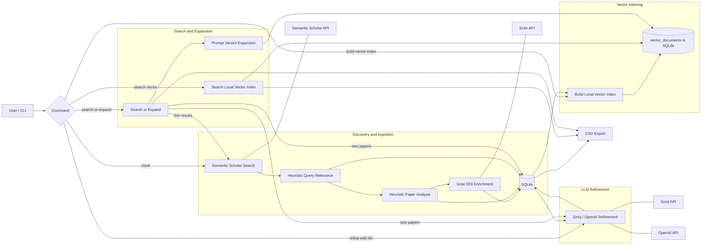

# SciteAI Architecture

## Notes

- SQLite is the source of truth for papers, authors, raw API payloads, and run history.
- `vector_documents` is a local search index backed by SQLite.
- `search-or-expand` uses heuristic prompt variants first, then crawls Semantic Scholar only if local coverage is thin.
- Groq/OpenAI is only used for post-ingest refinement, not for discovery.
- Scite enriches DOI-backed records with citation tallies and paper metadata when available.
